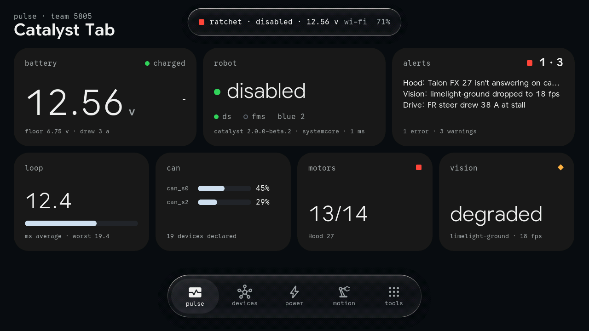
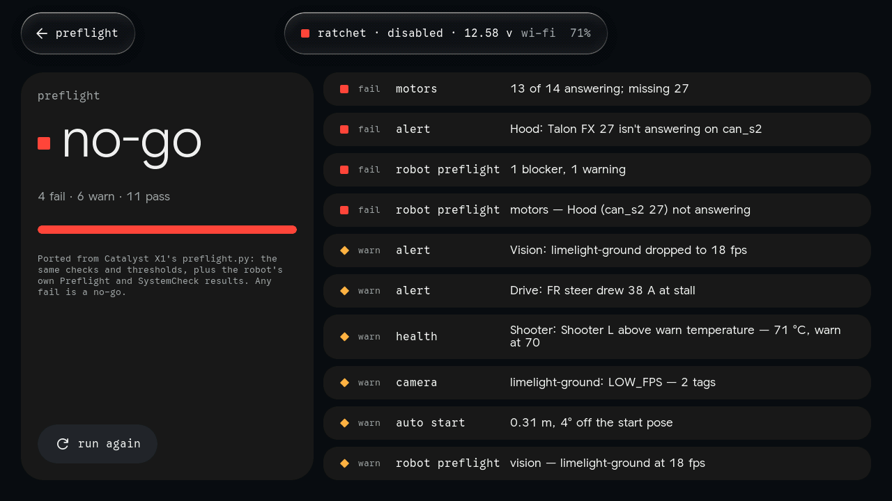
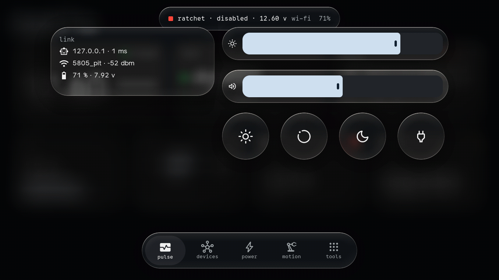
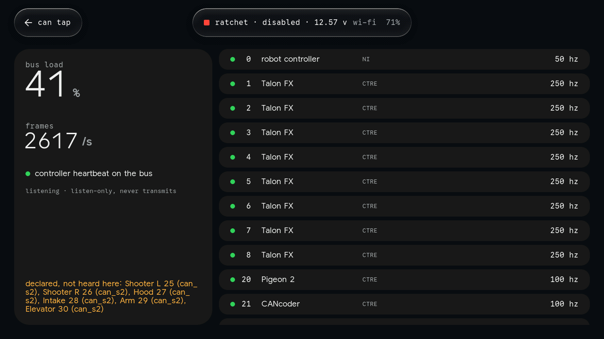
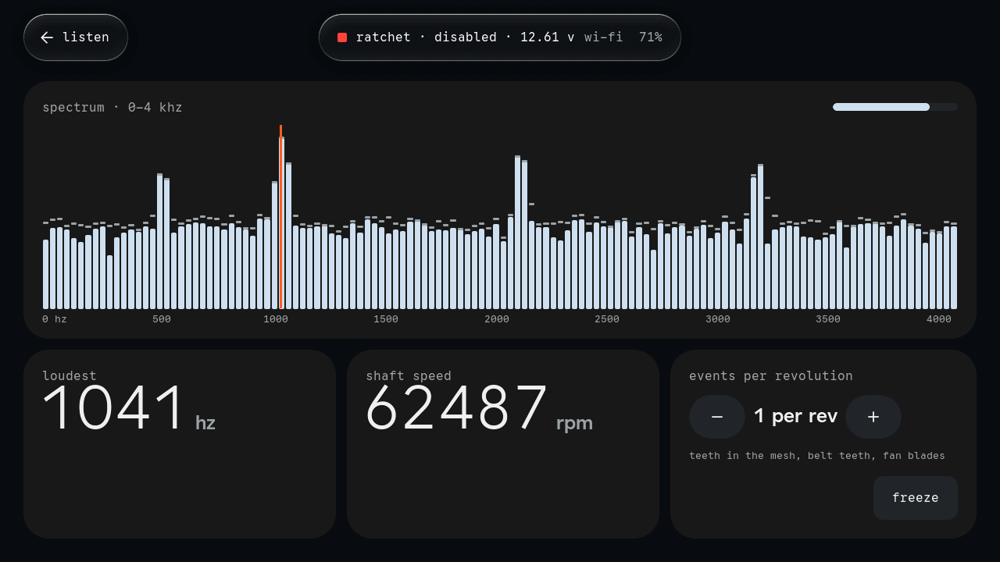
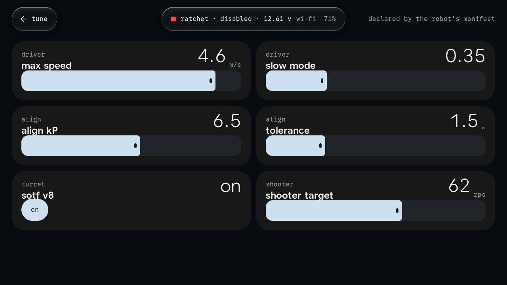
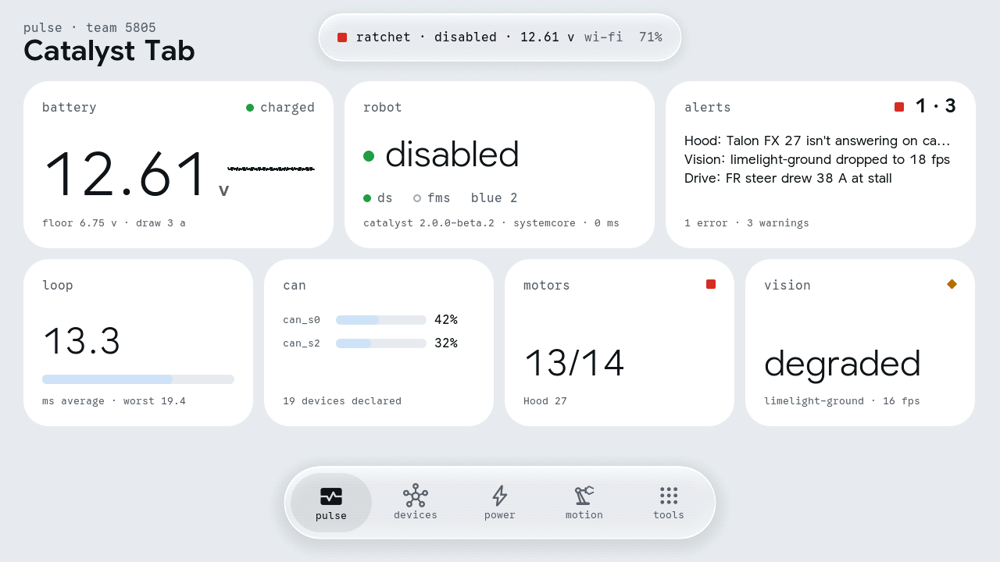

# Catalyst Tab

A pit-side diagnostics handheld for robots running [FrcCatalyst](https://github.com/TomAs-1226/FrcCatalyst),
built for the **M5Stack Tab5** (ESP32-P4 + ESP32-C6) and drawn in **Bezel**: embedded wall-panel
Material structure, Liquid Glass, Detent motion. It is Catalyst Console cut down to what a technician
needs with a robot on the cart, plus the tools only a device in your hand can have: it listens to a
gearbox, measures an arm against gravity, looks inside a bellypan, and hears the CAN bus directly.



**Status: built and simulated, not yet run on a Tab5.** The firmware compiles against ESP-IDF 5.5.1
with Espressif's Tab5 BSP; the UI, renderer, NetworkTables client and every tool run end to end in
the host simulator against a fake Catalyst robot, and 54 unit checks pass. The hardware layer
(`components/tab_hal/src/hal_tab5.c`) has not been on a device — see [First boot](#first-boot).

## What it does

| Screen | What it shows or does |
|---|---|
| **pulse** | Battery (with Console's bands), mode, DS/FMS, alliance, alerts, loop time, CAN load per bus, motors answering, vision health — the whole robot at a glance |
| **devices** | Every CAN device by bus, with its connection state (2.x roster) and the bus's utilization |
| **power** | The PDH's 24 channels with what each feeds and its live current (if the robot publishes its PDH), battery and total-current history, brownout floor and prediction |
| **motion** | Each mechanism (discovered from `/Catalyst/<name>/…`, not configured): position against goal, state, current, temperature; the four swerve modules as arrows, actual over commanded |
| **preflight** | X1's `preflight.py`, generalised and on the tablet: 3 s of listening, then GO / NO-GO with every fail and warning explained, and a chime |
| **alerts** | AlertManager, WPILib Alerts groups and firing HealthMonitor checks, worst first |
| **tune** | The robot's declared tunables as Bezel levels and toggles; writes land on release and echo back |
| **auto** | The auto chooser; picks write `…/Auto Selector/selected` |
| **field** | Pose, the active PathPlanner path, cameras, the tag in view; blink a Limelight to find it |
| **robot** | The spec sheet: identity, versions, link, Systemcore health, the results of the DS Utility routines |
| **listen** | The microphones' spectrum to 4 kHz; the loudest line becomes shaft RPM given the teeth per revolution |
| **level** | The IMU as an inclinometer, and an arm's encoder against gravity: "encoder minus gravity" |
| **lens** | The camera, freeze, and save a JPEG to microSD (hardware JPEG encoder) |
| **can tap** | A listen-only CAN sniffer on Grove Port A: who's talking, how often, bus load, the controller's heartbeat, and which declared devices are silent — works with the robot code dead |
| **logs** | `.wpilog`, `.dslog` and `.dsevents` from microSD: lowest battery, brownouts, trip time, CAN, CPU, events |
| **settings** | Team number, robot address, Wi-Fi, brightness, volume, tone, calm |
| **control center** | Pull down from the top edge: link, tablet battery, brightness, volume, tone, calm, sleep |

It never controls the robot. Catalyst exposes no command triggers over NetworkTables — diagnostics are
Driver Station Utility op modes — so the tablet writes only what Console writes (declared tunables,
the auto choice, a Limelight's LED) and shows the routines' results. Details:
[docs/catalyst-contract.md](docs/catalyst-contract.md).

## The Tab5, used

[docs/tab5-hardware.md](docs/tab5-hardware.md) is the capability research: every chip, its bus
address and pins, and what this firmware does with it. In short:

- **ESP32-P4** — core 1 renders (LVGL, two draw units across both cores) and composites the glass;
  core 0 runs NetworkTables and the HAL's audio, camera and CAN workers.
- **PPA** — rotates each finished landscape frame into the portrait panel's back buffer, copies and
  blends for the compositor, scales camera frames. Two DPI frame buffers flip on vsync: no tearing.
- **ESP32-C6** — Wi-Fi 6 to the robot through esp-hosted over SDIO.
- **Display + touch** — all three panel revisions (ILI9881C/GT911, ST7123, ST7121) through the BSP.
- **BMI270** — Level, and the glass's light leans with how you hold the tablet.
- **ES7210 mics** — Listen. **ES8388 + speaker** — detent ticks and chimes.
- **SC2356 camera + ISP + JPEG** — Lens. **microSD** — logs in, snapshots out.
- **INA226** — the tablet's battery. **RX8130** — time for logs and snapshots.
- **TWAI + Grove** — the CAN tap (with a Grove CAN transceiver unit). **RS-485 connector** — accepts
  6–24 V: run the tablet off the robot.
- Not used yet: USB-A host (a USB-Ethernet tether for events, where Wi-Fi to robots isn't allowed),
  BLE, the H.264 encoder, the LP core (which can't see the IMU or RTC interrupts on this board).

## Bezel on a microcontroller

The web specimen draws the page into a texture, blurs it through a pyramid, and composites refracting
glass over it with the glass's own labels on top. Here the same order runs on the CPU and the PPA:
LVGL renders the page (RGB565) and, separately, only what sits on glass (ARGB8888); `bz_comp.c` keeps
a quarter-scale blurred copy of the page under each glass group, a per-group geometry table for
refraction, rim light and shadow, and composites page → glass → ink only where something changed.
Springs are Detent's, solved in closed form (`bz_motion.c`). The numbers and the reasoning are in
[docs/bezel-port.md](docs/bezel-port.md).

| | |
|---|---|
|  |  |
|  |  |
|  |  |

## Building the firmware

ESP-IDF **5.5.1** (tested) with the esp32p4 toolchain:

```sh
cd tab5
. $IDF_PATH/export.sh
idf.py set-target esp32p4
idf.py build flash monitor
```

The component manager fetches LVGL 9.3.0, the Tab5 BSP and the rest. A few pins matter and are
explained where they're set:

- `esp_hosted ~1.4` with `esp_wifi_remote ~1.1.6`: the Tab5's C6 ships with esp-hosted 1.4.1 slave
  firmware; a 3.x host may not talk to it.
- `esp_lvgl_port ~2.6.0`: the BSP depends on it; 2.9 needs a DPI callback newer than IDF 5.5.1. The
  renderer drives the panel itself and never uses the port.
- `CONFIG_ESP32P4_SELECTS_REV_LESS_V3=y`: Tab5 silicon is v1.x; IDF ≥ 5.5.3 targets v3 without it
  (5.5.1 warns that it doesn't know the symbol — harmless).
- The HAL component is `tab_hal`, not `hal`: a project component named `hal` silently replaces
  ESP-IDF's own.

### First boot

What's most likely to need a correction on real hardware, each marked `UNVERIFIED` in `hal_tab5.c`:

1. **Orientation**: landscape is a 90° counter-clockwise turn; define `CATALYST_ROTATE_270` if the
   picture is upside down for how you hold it (touch follows automatically).
2. **IMU axes**: if Level reads mirrored, flip the signs in `hal_imu()`.
3. **CAN tap pins**: TX GPIO53, RX GPIO54 on Grove Port A; swap if a live bus stays silent.
4. **Microphone slot order** on the ES7210.
5. **PPA in-place blend**: self-tested at boot against the CPU (see the log); falls back if it disagrees.

## The simulator

Everything above the HAL is portable C. `sim/` builds it for Linux with a headless HAL — frames stay in
memory, `shot` writes PNGs, touches come from a script, and every sensor produces something plausible.

```sh
cd tab5
cmake -S sim -B build/sim -DLVGL_DIR=/path/to/lvgl-9.3.0 && cmake --build build/sim -j
python3 tools/fake_robot.py &                       # a pretend Catalyst 2.x robot (pip: websockets msgpack)
python3 tools/make_sample_logs.py build/sim_sd/logs # DS logs for the logs tool
cd build && ./sim/catalyst_tab_sim --script ../sim/tour.txt --out shots
./sim/catalyst_tab_tests                            # springs, msgpack, JSON, CAN ids, log parsers, FFT
```

`--probe` connects, prints what the tablet would show and writes one tunable, which is the quickest
check against a real robot: `./sim/catalyst_tab_sim --probe --robot 10.58.5.2`.

## Layout

```
tab5/
  main/main.c                 boot, the core split
  components/
    bezel/                    Bezel on LVGL: tokens, springs, the glass compositor, theme and widgets,
                              fonts baked by tools/make_fonts.py (Google Sans Flex / Code, Material Symbols)
    nt4/                      NetworkTables 4 client: WebSocket, msgpack, JSON, structs, ControlWord
    catalyst/                 the robot model, preflight, CAN id decoding, log parsers, the FFT
    ui/                       the shell (pager, dock, island, windows), pages, apps, control center
    tab_hal/                  hal.h, and hal_tab5.c for the tablet
  sim/                        the Linux simulator (hal_sim.c, sim_main.c, tour.txt)
  test/                       unit tests
  tools/                      fake_robot.py, make_sample_logs.py, make_fonts.py
  docs/                       tab5-hardware.md, catalyst-contract.md, bezel-port.md, shots/
  lv_conf.h                   one LVGL configuration for both builds
```
