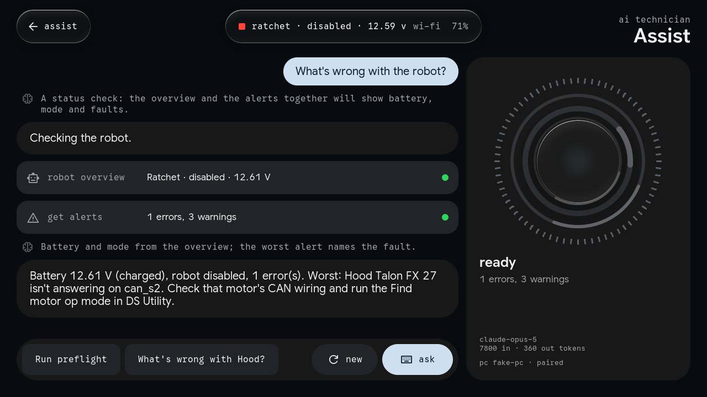
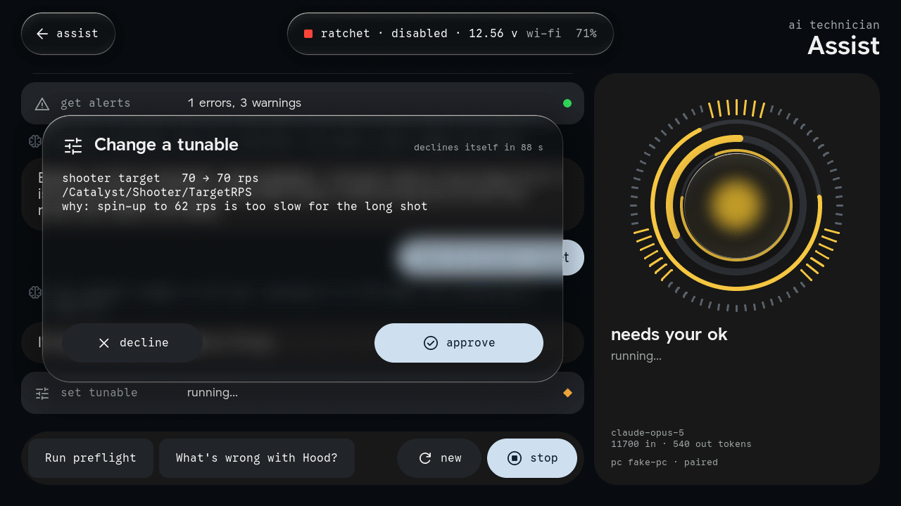
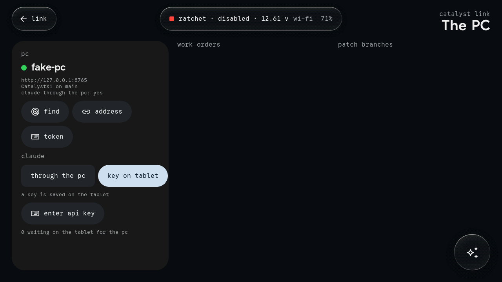
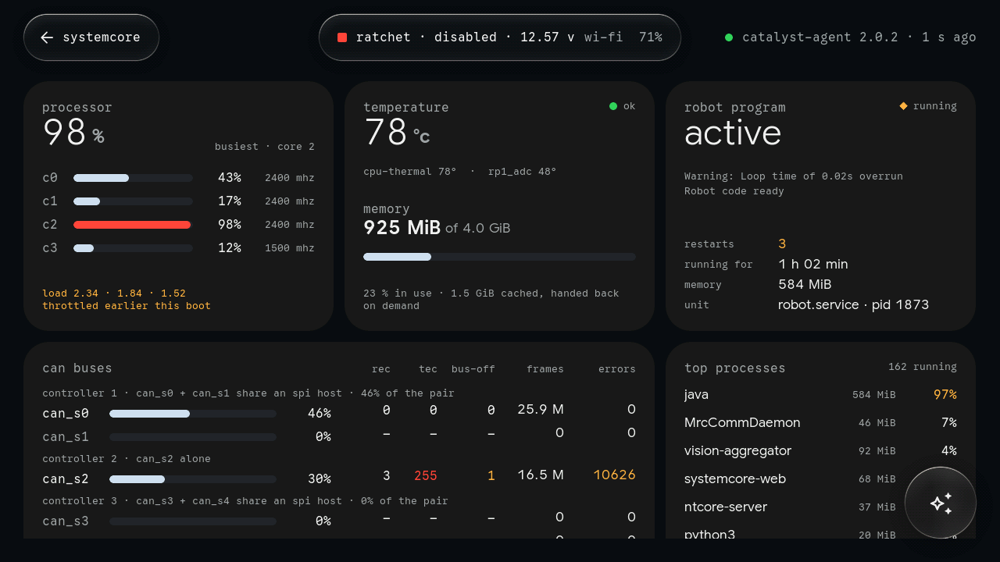
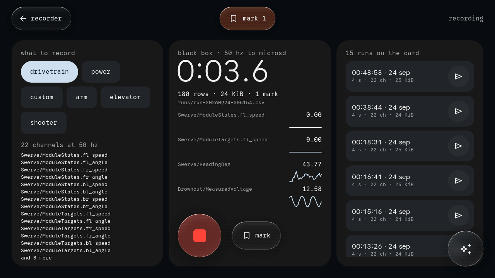
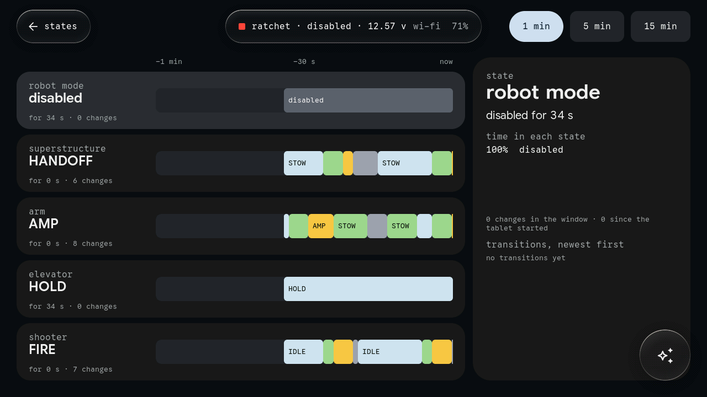
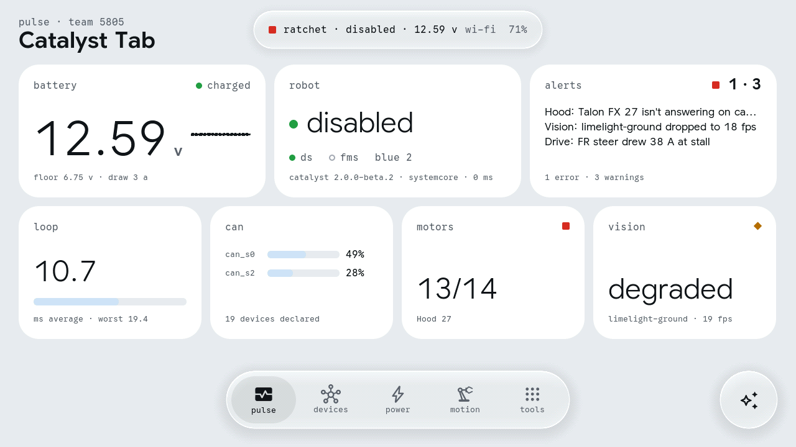

# Catalyst Tab

A pit-side diagnostics handheld for robots running [FrcCatalyst](https://github.com/TomAs-1226/FrcCatalyst),
built for the **M5Stack Tab5** (ESP32-P4 + ESP32-C6) and drawn in **Bezel**: embedded wall-panel
Material structure, Liquid Glass, Detent motion. It is Catalyst Console cut down to what a technician
needs with a robot on the cart, plus what only a device in your hand can do: plug straight into the
Systemcore over USB, measure an arm against gravity, look inside a bellypan, hear the CAN bus
directly — and an AI technician that can diagnose the robot, stage a code fix on your PC, and leave
work for your PC's own coding agent.


**Status: built and simulated, not yet run on a Tab5.** The firmware compiles against ESP-IDF 5.5.1
with Espressif's Tab5 BSP (no warnings from the project's own code). The UI, the renderer,
NetworkTables, the assistant and every tool run end to end in the host simulator against a fake
Catalyst robot, a fake catalyst-agent and a fake Claude. 451 unit checks and Catalyst Link's 58 tests
pass. The hardware layer (`components/tab_hal/src/hal_tab5*.c`) has not been on a device yet. See
[First boot](#first-boot).

## What it does

| Screen | What it shows or does |
|---|---|
| **pulse** | Battery (with Console's bands), mode, DS/FMS, alliance, alerts, loop time, CAN load per bus, motors answering, vision health: the whole robot at a glance |
| **devices** | Every CAN device by bus, its connection state (2.x roster) and the bus's utilization |
| **power** | The PDH's 24 channels, what each feeds and its live current; battery and total-current history; brownout floor and prediction |
| **motion** | Each mechanism discovered from `/Catalyst/<name>/…`: position against goal, state, current, temperature; the swerve modules as arrows, actual over commanded |
| **preflight** | X1's `preflight.py` on the tablet: 3 s of watching, then GO / NO-GO with every fail and warning explained, and a chime |
| **alerts** | AlertManager, WPILib Alerts groups and firing HealthMonitor checks, worst first |
| **tune** | The robot's declared tunables as Bezel levels and toggles. Writes land on release and echo back; a snapshot is taken before the first change of each visit, so it can be undone |
| **auto** | The auto chooser; picks write `…/Auto Selector/selected` |
| **field** | Pose, the active PathPlanner path, cameras, the tag in view; blink a Limelight to find it |
| **robot** | The spec sheet: identity, versions, link, Systemcore health, the DS Utility routines' results |
| **systemcore** | The controller itself, from catalyst-agent: each core's clock, load and throttling, temperatures, memory, the robot program (state, restarts, its last lines), CAN by bus with REC/TEC/bus-off, processes, storage, eMMC, network interfaces (`usb0` is the tether) |
| **motors** | Every device's lifetime from `MotorHistory`: loaded, turning and hot time, powered hours, peak temperature, past identities, a bar per recent boot |
| **states** | Timelines of the robot's mode and every state machine, recorded by the tablet from boot: time in each state and the transitions over 1, 5 or 15 min |
| **controls** | Each controller in `/Catalyst/Controls/.manifest`, its bindings numbered on a pad diagram |
| **recorder** | A 50 Hz black box to microSD (drivetrain, power, a mechanism, or any numeric topics), live sparklines, marks, and "send to PC" |
| **can tap** | A listen-only CAN sniffer on Grove Port A: who's talking, how often, bus load, the controller's heartbeat, and which declared devices are silent. Works with the robot code dead |
| **assist** | The AI technician (below) |
| **link** | Pairing with Catalyst Link on the PC, the route Claude takes, the PC agent's inbox and the patches waiting there |
| **logs** | `.wpilog`, `.dslog` and `.dsevents` from microSD: lowest battery, brownouts, trip time, CAN, CPU, events |
| **level** | The IMU as an inclinometer, and an arm's encoder against gravity ("encoder minus gravity") |
| **lens** | The camera: freeze, save a JPEG (hardware encoder), record an H.264 clip (hardware encoder) and send it to the PC |
| **settings** | Team, robot address, the USB tether, Wi-Fi, brightness, volume, tone, calm, the frame-time overlay |
| **control center** | Pull down from the top edge: robot, Wi-Fi and USB links, tablet battery, brightness, volume, tone, calm, sleep |

The assistant's orb sits bottom right on every page; tap it to ask about what you're looking at.

It never drives the robot. Catalyst exposes no command triggers over NetworkTables (diagnostics are
Driver Station Utility op modes), so the tablet writes only what Console writes: declared tunables,
the auto choice and a Limelight's LED. Details are in
[docs/catalyst-contract.md](docs/catalyst-contract.md) and [docs/systemcore.md](docs/systemcore.md).

## The AI technician

`components/assist/` is a Claude conversation (the Messages API, streamed; Claude Opus 5 with
adaptive thinking) whose tools are the robot, the tablet and the PC. It has 26 tools. It **reads**
everything the tablet reads: the overview, alerts, mechanisms, power, CAN, vision, preflight, any
topic, tunables, autos, logs, Systemcore health, motor history, and the robot's code on the PC
(tree, read, search). It **changes** things in only three ways, and each one first puts a card on
screen that you approve or decline (a card declines itself after 90 s):

- **a tunable or the auto choice**, with a snapshot taken first so it can be reverted;
- **a patch to the robot's code**: Catalyst Link applies it on a new branch in its own worktree on the
  PC. It never touches the branch you're on, never pushes, never deploys, and never deletes a file;
- **a work order** in the Link's inbox, for the PC's own coding agent to pick up asynchronously. It
  carries the diagnosis, the robot snapshot and the relevant files.

Requests go through the Link or straight to the API with a key stored on the tablet. The Link reaches
Claude one of two ways: with no API key at all, through **Claude Code on the PC, logged in with the
owner's Claude subscription** (the default when the PC has no key; the tablet's tools are handed to
Claude Code and still run, and still ask, on the tablet), or with an `ANTHROPIC_API_KEY` that stays on
the PC. Setup is in [link/README.md](link/README.md#claude-with-your-claude-subscription-no-api-key).
On the API routes server-side fallbacks are enabled (`fallbacks: "default"`), so an overloaded model
falls back instead of failing mid-diagnosis. When the Link is away, patches, work orders and
uploads wait in a store-and-forward outbox on microSD.

**Catalyst Link** ([link/](link/README.md)) is the PC side: a small Python server beside the robot
project's git repo. It gives the tablet read-only code, patch branches, the work-order inbox, a file
drop and the Claude proxy, all behind a token, and it audits every write. [link/AGENT.md](link/AGENT.md)
tells the PC's agent how to work the inbox. The wire contract is in
[docs/link-api.md](docs/link-api.md).

| | |
|---|---|
|  |  |
|  |  |

## The Tab5, used

[docs/tab5-hardware.md](docs/tab5-hardware.md) is the capability research: every chip, its bus
address and pins, and what this firmware does with it. In short:

- **ESP32-P4.** Core 1 renders (LVGL with two draw units, one per core) and composites the glass.
  Core 0 runs NetworkTables, the tether, the CAN tap, tones, the camera, the encoder and the HTTPS
  workers.
- **PPA.** Rotates each finished landscape frame into the portrait panel's back buffer
  asynchronously. It also copies and blends for the compositor, converts camera frames to YUV for
  the H.264 encoder, and scales them. Two DPI frame buffers flip on vsync, at 60.5 Hz.
- **USB-A host (high speed).** The **USB tether**: the Systemcore's USB-C port through an A-to-C
  cable (its ECM/RNDIS gadget, 172.26/172.27.x), or a USB-Ethernet dongle (CDC-ECM or RNDIS) into
  the radio or a switch. The tether is preferred over Wi-Fi when both are up. A dongle that gets no
  DHCP answer falls back to a static 10.TE.AM.60.
- **ESP32-C6.** Wi-Fi 6 to the robot, through esp-hosted over SDIO.
- **Display + touch.** All three panel revisions (ILI9881C/GT911, ST7123, ST7121) through the BSP.
- **BMI270.** Used by Level; the glass's light also leans with how you hold the tablet.
- **ES8388 + speaker.** Detent ticks and chimes.
- **SC2356 camera + ISP.** Feeds Lens: **JPEG** encoder for stills, **H.264** encoder for clips.
- **microSD.** Logs in; snapshots, clips, recordings and the outbox out.
- **INA226** for the tablet's battery; **RX8130** for time on logs and files.
- **TWAI + Grove.** The CAN tap, with a Grove CAN transceiver unit.
- **RS-485 connector.** Accepts 6–24 V, so the tablet can run off the robot.
- **ES7210 microphones**, only while the companion is on screen: its wake word ("Hi, ESP", heard on
  the tablet) and the questions it sends to OpenAI.
- **Deliberately unused.** BLE (nothing on an
  FRC robot to talk to). The LP core, which can't see the IMU or RTC interrupts on this board.
  RS-485 serial, which no FRC device speaks.

## Bezel on a microcontroller, at 60 Hz

The web specimen draws the page into a texture, blurs it through a pyramid, and composites
refracting glass over it with the glass's own labels on top. Here the same order runs on the CPU and
the PPA. LVGL renders the page (RGB565) and, separately, only what sits on glass (ARGB8888).
`bz_comp.c` keeps, per glass group, a quarter-scale blurred copy of the page under it and a geometry
table for refraction, rim light and shadow. It composites page → glass → ink only where something
changed, and hands unchanged areas to the panel straight from where their pixels already are.
Springs are Detent's, solved in closed form (`bz_motion.c`).

A 360 MHz CPU can't redraw a 1280 × 720 page in a frame, so nothing big is drawn twice while it
moves:

- pages swipe as one cached picture;
- app windows grow as a picture over a picture;
- lists scroll by moving the rows already drawn;
- the catch-up after a gesture is spread over eight frames under the pictures;
- background refreshes go a band at a time.

The simulator costs each frame's work for the P4 (`trace` in a script). Swipes, dock jumps, list
scrolls, app open/close and the assistant streaming all model under 16.7 ms at p95. The **control
center** doesn't yet: pulling it runs at ~16 ms on average but p95 47 ms. The numbers, and what it
would take, are in [docs/bezel-port.md](docs/bezel-port.md#keeping-60-hz). On the tablet, the
settings screen's `fps` chip shows measured frame times.

| | |
|---|---|
|  |  |
|  |  |
|  |  |

## Flashing the prebuilt image

[firmware/](firmware/README.md) has a ready-to-flash build. With the Tab5's USB-C plugged in:

```sh
esptool.py --chip esp32p4 -b 921600 write_flash 0x0 firmware/catalyst-tab-merged.bin
```

You can also flash it from a browser at <https://espressif.github.io/esptool-js/> (address `0x0`).
[firmware/README.md](firmware/README.md) covers updating without losing your settings, and what to
do on first boot.

## Building the firmware

ESP-IDF **5.5.1** (tested) with the esp32p4 toolchain:

```sh
cd tab5
. $IDF_PATH/export.sh
idf.py set-target esp32p4
idf.py build flash monitor
```

The component manager fetches LVGL 9.3.0, the Tab5 BSP, the USB host network drivers, esp_h264 and
the rest. A few pins matter and are explained where they're set:

- `esp_hosted ~1.4` with `esp_wifi_remote ~1.1.6`: the Tab5's C6 ships with esp-hosted 1.4.1 slave
  firmware; a 3.x host may not talk to it.
- `esp-sr ~2.4.7`: the companion's wake word ("Hi, ESP", WakeNet9). Its model goes into the `model`
  partition as `build/srmodels/srmodels.bin` (at 0xa50000); `idf.py flash` writes it, and a merged image
  must include it, or the companion falls back to tap-to-talk.
- `esp_lvgl_port ~2.6.0`: the BSP depends on it; 2.9 needs a DPI callback newer than IDF 5.5.1. The
  renderer drives the panel itself and never uses the port.
- `CONFIG_ESP32P4_SELECTS_REV_LESS_V3=y`: Tab5 silicon is v1.x; IDF ≥ 5.5.3 targets v3 without it
  (5.5.1 warns that it doesn't know the symbol, which is harmless).
- The HAL component is `tab_hal`, not `hal`: a project component named `hal` silently replaces
  ESP-IDF's own.
- After changing `sdkconfig.defaults`, delete `sdkconfig` so it's regenerated. A stale one keeps old
  memory settings and the link fails with an SRAM overflow.

### First boot

What's most likely to need a correction on real hardware, each marked `UNVERIFIED` in the HAL:

1. **Orientation**: landscape is a 90° counter-clockwise turn; define `CATALYST_ROTATE_270` if the
   picture is upside down for how you hold it (touch follows automatically).
2. **IMU axes**: if Level reads mirrored, flip the signs in `hal_imu()`.
3. **CAN tap pins**: TX GPIO53, RX GPIO54 on Grove Port A; swap if a live bus stays silent.
4. **PPA in-place blend**: self-tested at boot against the CPU (see the log); falls back if it disagrees.
5. **The USB tether**: the Systemcore's composite gadget and a dongle each come up as the expected
   interface. The checklist is in [docs/tab5-hardware.md](docs/tab5-hardware.md#first-boot-checklist).
6. **Frame pacing**: the async present should never log "overdue". Turn on the `fps` overlay and
   compare its measured times with the model in `docs/bezel-port.md`.

## The simulator

Everything above the HAL is portable C. `sim/` builds it for Linux with a headless HAL: frames stay
in memory, `shot` writes PNGs, touches come from a script, and every sensor produces something
plausible.

```sh
cd tab5
cmake -S sim -B build/sim -DLVGL_DIR=/path/to/lvgl-9.3.0 && cmake --build build/sim -j
python3 tools/fake_robot.py &                       # a Catalyst 2.x robot over NT4 (pip: websockets msgpack)
python3 tools/fake_agent.py &                       # catalyst-agent on :9010, for systemcore and motors
python3 tools/fake_claude.py --port 8787 --link-port 8765 &   # a scripted Claude, and a Link
python3 tools/make_sample_logs.py build/sim_sd/logs # DS logs for the logs tool
cd build && ./sim/catalyst_tab_sim --script ../sim/tour.txt --out shots \
    --claude http://127.0.0.1:8787 --link http://127.0.0.1:8765 test-token
./sim/catalyst_tab_tests                            # springs, msgpack, JSON, CAN ids, logs, assist, Systemcore
python3 -m unittest discover -s link/tests          # Catalyst Link (from tab5/)
```

`--claude` points the assistant at a Messages API and `--link` pairs it with a Catalyst Link. The
real one works too (`pip install -e link`, then `catalyst-link serve --repo ~/robot`; it prints the
token). A script can also contain
`ask <question>`, and `trace NAME` … `trace end`, which prints the P4 frame-cost model for what
happened in between (`SIM_TRACE_FRAMES=1` prints every frame).

`--probe` connects, prints what the tablet would show and writes one tunable. It is the quickest
check against a real robot: `./sim/catalyst_tab_sim --probe --robot 10.58.5.2`.

## Layout

```
tab5/
  main/main.c                 boot, the core split
  components/
    bezel/                    Bezel on LVGL: tokens, springs, the glass compositor, motion caches,
                              theme and widgets; fonts baked by tools/make_fonts.py
    nt4/                      NetworkTables 4 client: WebSocket, msgpack, JSON, structs, ControlWord
    catalyst/                 the robot model, preflight, CAN ids, log parsers, Systemcore and
                              catalyst-agent (cat_sc*), state timelines, the recorder
    assist/                   the AI technician: SSE client, conversation, tools, snapshots, the Link client
    ui/                       the shell (pager, dock, island, windows, orb), pages, apps, control center
    tab_hal/                  hal.h; hal_tab5.c (display, PPA, sensors, camera, H.264) and
                              hal_tab5_net.c (Wi-Fi, the USB tether, HTTP)
  link/                       Catalyst Link, the PC side (Python)
  sim/                        the Linux simulator (hal_sim.c, hal_sim_net.c, sim_main.c, tour.txt)
  test/                       unit tests
  tools/                      fake_robot.py, fake_agent.py, fake_claude.py, make_sample_logs.py, make_fonts.py
  firmware/                   a prebuilt image to flash (see firmware/README.md)
  docs/                       tab5-hardware.md, catalyst-contract.md, systemcore.md, link-api.md,
                              bezel-port.md, shots/
  lv_conf.h                   one LVGL configuration for both builds
```
